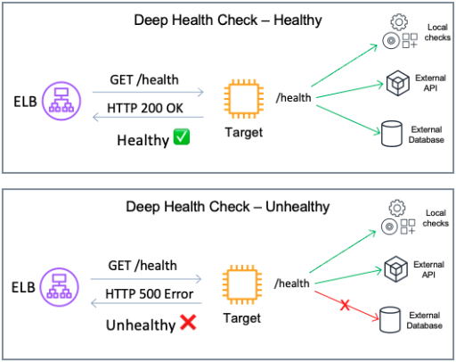
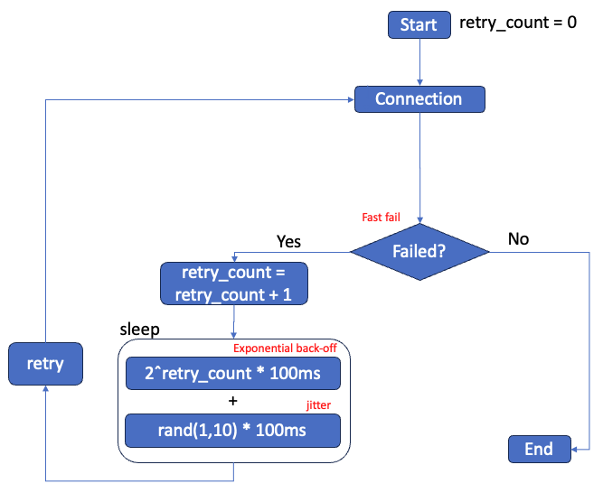

# Failure Management

---

## Health Checks

### Deep health checks

Configure your health check protocol to be more comprehensive than just a simple TCP check. While TCP checks can indicate basic connectivity, they often don't provide a holistic view of the service's health. Implementing deep health checks is recommended. Deep health checks are more detailed checks to make sure that each service in your system is running optimally. In contrast to shallow health checks (which might only verify that a server is running), deep health checks involve checking not only local components in the targets but also dependencies that are vital for your applications to work.

Note that your application may not natively offer a HTTP/HTTPS service so you may have to create a small web service that (when called) is able to fully check the health of the service that is running and then respond appropriately to the health check.

!!! tip "Best Practice"
--8<-- "alb-bp-rel09.md"

*Image: Deep health check configuration, checking dependencies and returning error if a connection to a dependency fails.*

!!! note "Considerations"
    - Deep health checks should include only critical dependencies vital for the service's operation. If a "soft" dependency, which is not essential, is included in these checks, it may inadvertently be treated as a critical one, potentially increasing the scope of the impact during failures. [This article from the Amazon Builder's library](https://aws.amazon.com/builders-library/implementing-health-checks/) details the associated risks and trade-offs.

    - Deep health checks can become computationally expensive. Some factors such as the number of nodes, cross-zone configuration and health check frequency can increase the number of health check probes. To prevent the response to health checks become a burden for the system and its dependencies, consider creating a process that checks dependency and write a static file. The static file will then be updated by a single process but used by all health check attempts.

!!! abstract "References and Further Information"
    [Choosing the right health check with Elastic Load Balancing and EC2 Auto Scaling](https://aws.amazon.com/blogs/networking-and-content-delivery/choosing-the-right-health-check-with-elastic-load-balancing-and-ec2-auto-scaling/){:target="_blank"}

    [Implementing health checks](https://aws.amazon.com/builders-library/implementing-health-checks/){:target="_blank"}

    [Workshop - Implement deep health checks](https://catalog.workshops.aws/well-architected-reliability/en-US/3-change-management/20-implementing-health-checks-and-dependencies/3-deep-healthcheck){:target="_blank"}

    [AWS re:Invent 2023 - Enhance your app’s security & availability with Elastic Load Balancing](https://www.youtube.com/watch?v=6iO6wtDOKGM&t=466s){:target="_blank"}

---

### Health Check interval and timeout

When configuring health check settings such as timeout, threshold, and interval, it's crucial to align your strategy with your availability goals. One key goal might be to quickly remove a failing target to maintain system integrity, while also being mindful of avoiding false positives. However, it's important to consider scenarios where the entire system is under heavy load and may struggle to respond to health check probes. Such situations can lead to a downward spiral problem, where overloaded targets are removed, inadvertently increasing the load on the remaining ones, potentially leading to their removal as well.

There are two common strategies to address this:

1. **Brownout** : This strategy allows targets to continue operating under heavy load, however with slower response times. Implementation involves setting longer intervals and timeouts for health checks.
2. **Blackout**: This strategy prioritizes fail away and/or quickly terminate any failing resources. It is implemented by configuring shorter intervals and timeouts for health checks.

!!! tip "Best Practice"
--8<-- "alb-bp-rel10.md"

!!! abstract "References and Further Information"
    
    [AWS re:Invent 2023 - Enhance your app’s security & availability with Elastic Load Balancing](https://www.youtube.com/watch?v=6iO6wtDOKGM&t=466s){:target="_blank"}

    [AWS re:Invent 2019: Get the most from Elastic Load Balancing for different workloads](https://youtu.be/HKh54BkaOK0?si=H5YblaDZpwx3k4_c&t=2729){:target="_blank"}

    [NLB - Health check settings](https://docs.aws.amazon.com/elasticloadbalancing/latest/network/target-group-health-checks.html#health-check-settings){:target="_blank"}

    [ALB - Health check settings](https://docs.aws.amazon.com/elasticloadbalancing/latest/application/target-group-health-checks.html#health-check-settings){:target="_blank"}

---
## Client behavior

When designing with high availability in mind, it's crucial to factor in client behavior. Clients interacting with an Network or Application Load Balancers. During periods of system overload or partial failure, these clients can exacerbate the issue by adding additional load to the system by competing for resources.

In the following section, we focus on clients and how they can be configured to allow for predictable and controlled behavior.

*High level overview of an example of client retry logic, details in the following sections.*

!!! note "Note"
    This best practice is based on scenarios where client behavior can be adjusted, often the case with SDK clients and Content Delivery Networks (CDNs). When clients are end-users utilizing web browsers, they are typically less susceptible to the issues mentioned in this section.

!!! abstract "References and Further Information"
    [Timeouts, retries, and backoff with jitter](https://aws.amazon.com/builders-library/timeouts-retries-and-backoff-with-jitter/){:target="_blank"}

### Fail-fast

When setting up a client, you'll often have an estimate of the time required for a standard request to complete. Your load balancer's idle timeout needs to cater to the slowest expected request. However, if you can control the client timeout logic, it is recommended to fail fast, when you know the request is taking longer than expected. In other words, if your clients is performing a simple GET request that typically takes less than 1 second to be completed, the client should not wait for 60 seconds if the server is not responding. Failing fast allows the client to quickly switch to another load balancer IP, potentially rerouting to a different target and improving the request's chance of success. It's important to pair this technique with strategies like [Retrying failed requests with exponential back-off and jitter](/aws-elb-best-practices/reliability/failure_management/#retrying-failed-requests-with-exponential-back-off-and-jitter), as failing fast might add extra strain to an already burdened system.

!!! tip "Best Practice"
--8<-- "alb-bp-rel11.md"

!!! abstract "References and Further Information"
    [Set client timeouts](https://docs.aws.amazon.com/wellarchitected/latest/reliability-pillar/rel_mitigate_interaction_failure_client_timeouts.html){:target="_blank"}

    [Fail fast and limit queues](https://docs.aws.amazon.com/wellarchitected/latest/reliability-pillar/rel_mitigate_interaction_failure_fail_fast.html)

---
### Retrying failed requests with exponential back-off and jitter

When clients experience connection or requests failures, retrying is a common response. While this is generally a good practice, it's important to note that simultaneous retries from multiple clients can lead to a phenomenon known as a **"retry storm"**. This situation can overload the system, reducing the likelihood of successful connections and delaying service recovery.

To implement retries effectively, consider the following guidelines:

* Use retries to handle partial and transient failures, understanding that they work best when failures are infrequent or short-lived.
* Apply backoff strategies, such as exponential backoff with limits on retry attempts, to avoid exacerbating failures caused by system overloads.
* Design APIs to be idempotent to ensure that retries do not have unintended side effects.
* Introduce jitter to retry mechanisms and periodic work to avoid synchronized retries and spikes in load, which helps in spreading out the demand on resources over time.

It's crucial to carefully balance and coordinate timeouts, retries, backoff, and jitter to mitigate the risks associated with distributed system failures while maintaining system performance and availability.

!!! tip "Best Practice"
--8<-- "alb-bp-rel12.md"

!!! abstract "References and Further Information"

    [Timeouts, retries, and backoff with jitter](https://aws.amazon.com/builders-library/timeouts-retries-and-backoff-with-jitter/){:target="_blank"}

    [AWS re:Invent 2019: Get the most from Elastic Load Balancing for different workloads](https://youtu.be/HKh54BkaOK0?si=OzdPWzJASNDqJ9cg&t=389){:target="_blank"}

    [Exponential Backoff And Jitter](https://aws.amazon.com/blogs/architecture/exponential-backoff-and-jitter/){:target="_blank"}

    [Making retries safe with idempotent APIs](https://aws.amazon.com/builders-library/making-retries-safe-with-idempotent-APIs/){:target="_blank"}

    [Control and limit retry calls](https://docs.aws.amazon.com/wellarchitected/latest/reliability-pillar/rel_mitigate_interaction_failure_limit_retries.html){:target="_blank"}

    [Retry with backoff pattern](https://docs.aws.amazon.com/prescriptive-guidance/latest/cloud-design-patterns/retry-backoff.html){:target="_blank"}

---
### Use DNS to deliver traffic to load balancers

Clients use the [Domain Name Service (DNS)](https://en.wikipedia.org/wiki/Domain_Name_System){:target="_blank"} to determine how to reach the load balancer for your application. DNS provides the IP address that the client connects to. The ELB service (which includes Classic Load Balancer, Application Load Balancer and Network Load Balancer) constantly monitors the health and status of each load balancer. When necessary it updates the load balancer DNS records to only include the IP addresses of healthy and properly scaled resources. For ALB and CLB there are various operations that can cause the IP address of the load balancer to change - therefore, clients should not use IP addresses. Instead, they should use DNS to resolve the IP addresses of available load balancers. Multiple IP addresses may be returned in a DNS response (depending on the load balancer nodes that are active and healthy) so clients should attempt to connect to a different IP should the first connection attempt fail. Finally, the DNS record Time to Live (TTL) for load balancers is 60 seconds. DNS TTL is the numeric value (in seconds) that DNS resolvers use to determine how long to cache a record before making another query to Route 53. It is important the clients honor that and perform lookups when the DNS record they previously retrieved has expired.

!!! tip "Best Practice"
--8<-- "alb-bp-rel07.md"

!!! tip "Best Practice"
--8<-- "alb-bp-rel08.md"

!!! note "Note"
    NLB works with static IP addresses and it is an alternative for clients unable to operate based on DNS. However, we recommend using DNS for NLB when you can. This is because, in scenarios where targets in an availability zone are failing the Health Checks and cross-zone load balancing is turned off, the load balancer's DNS record is updated to exclude the IP addresses of the affected zone. As a result, adhering to DNS results can enhance the reliability and availability of connections to NLBs. This approach helps ensure that traffic is directed to healthy and operational zones, maintaining efficient load balancing.

!!! abstract "References and Further Information"
    [AWS re:Invent 2019: Get the most from Elastic Load Balancing for different workloads](https://youtu.be/HKh54BkaOK0?si=OzdPWzJASNDqJ9cg&t=389){:target="_blank"}

---
## Use Amazon Route 53 Application Recovery Controller for zonal shift

If you are experiencing issues in your AWS environment that are isolated to a single Availability Zone (AZ), it's often advisable to shift traffic away from that AZ. In an ideal setup, effective health checks would identify the system's unavailability in that AZ, triggering an automated failover in DNS. This process would result in the removal of the load balancer nodes in the impacted AZ from the DNS response. However,  particularly in cases of intermittent or [gray failures](https://docs.aws.amazon.com/whitepapers/latest/advanced-multi-az-resilience-patterns/gray-failures.html){:target="_blank"}, you may want to proactively ensure that an AZ is evacuated until specific readiness checks are passing. Amazon Route 53 Application Recovery Controller integrates with both Application and Network Load Balancers for zonal shift operations when necessary. This [blog post](https://aws.amazon.com/blogs/networking-and-content-delivery/building-highly-resilient-applications-using-amazon-route-53-application-recovery-controller-part-1-single-region-stack/){:target="_blank"} covers in details how to build resilient applications using this feature.

!!! tip "Best Practice"
--8<-- "alb-bp-rel13.md"

!!! abstract "References and Further Information"

    [Advanced Multi-AZ Resilience Patterns](https://docs.aws.amazon.com/whitepapers/latest/advanced-multi-az-resilience-patterns/advanced-multi-az-resilience-patterns.html){:target="_blank"}

    [Amazon Route 53 Application Recovery Controller](https://aws.amazon.com/route53/application-recovery-controller/){:target="_blank"}

    [Building highly resilient applications using Amazon Route 53 Application Recovery Controller, Part 1: Single-Region stack](https://aws.amazon.com/blogs/networking-and-content-delivery/building-highly-resilient-applications-using-amazon-route-53-application-recovery-controller-part-1-single-region-stack/){:target="_blank"}

    [Best practices for zonal shifts in Route 53 ARC](https://docs.aws.amazon.com/r53recovery/latest/dg/route53-arc-best-practices.html#route53-arc-best-practices.zonal-shifts){:target="_blank"}

    [AWS re:Invent 2023 - Using zonal autoshift to automatically recover from an AZ impairment](https://www.youtube.com/watch?v=_0F-wdwiqZo){:target="_blank"}