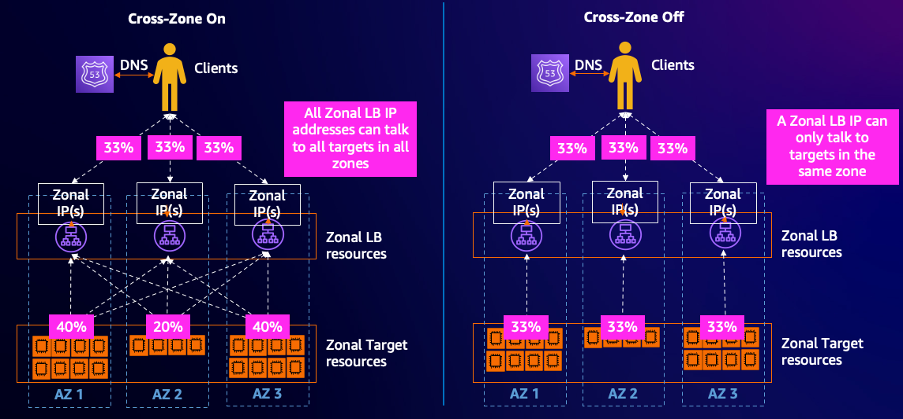
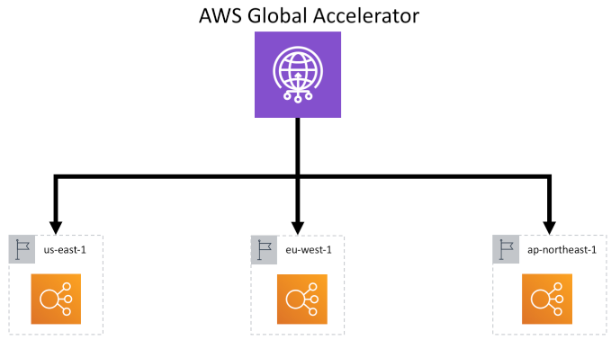

# Workload Architecture

## Use multiple Availability Zones

AWS always recommends that your workloads use two or more Availability Zones (AZs) for improved reliability. This is a [best practice in the Reliability Pillar of the AWS Well-Architected Framework](https://docs.aws.amazon.com/wellarchitected/latest/reliability-pillar/rel_fault_isolation_multiaz_region_system.html){:target="_blank"}. Configuring your load balancers to use multiple Availability Zones (AZs) ensures that they can benefit from the isolation of partitions of AWS infrastructure.

By setting up your load balancers to use multiple AZs, you enhance fault tolerance. If one Availability Zone becomes unavailable or has less healthy targets than the DNS failover threshold (default = 1), the load balancer performs a DNS failover to automatically route traffic to healthy targets in other Availability Zones. This ensures that your application remains accessible even in the event of an issue in one of the AZs.

!!! tip "Best Practice"
--8<-- "alb-bp-rel01.md"

Equally important, all AZs in use by your ELB should have targets registered in them. This reduces the chance of impact during an AZ impairment.

!!! tip "Best Practice"
--8<-- "alb-bp-rel06.md"

!!! abstract "References and Further Information"

    [Deploy the workload to multiple locations](https://docs.aws.amazon.com/wellarchitected/latest/reliability-pillar/rel_fault_isolation_multiaz_region_system.html){:target="_blank"}

    [Regions and Availability Zones](https://aws.amazon.com/about-aws/global-infrastructure/regions_az/){:target="_blank"}

    [Using load balancer target group health thresholds to improve availability](https://aws.amazon.com/blogs/networking-and-content-delivery/using-load-balancer-target-group-health-thresholds-to-improve-availability/){:target="_blank"}

---
## Availability Zone Independence (AZI)

To improve the availability of your load balancer in scenarios where a specific Availability Zone (AZ) faces issues, it is important to shift traffic away from the impacted AZ. A successful zonal evacuation strategy requires [Availability Zone Independence (AZI)](https://aws.amazon.com/blogs/networking-and-content-delivery/using-load-balancer-target-group-health-thresholds-to-improve-availability/){:target="_blank"} which in turn requires cross-zone load balancing to be turned off.

!!! tip "Best Practice"
--8<-- "alb-bp-rel02.md"

!!! note "Considerations"

    * Turning off cross-zone load balancing can lead to uneven traffic distribution at the target level. To prevent this, ensure you have a an equal number of targets in each Availability Zone.
    
    * With cross-zone load balancing turned off, it's crucial to prepare for potential zonal evacuations by ensuring sufficient target capacity at the remaining AZ(s) to manage the traffic. This can be achieved using an Auto Scaling or a [Static stability](#static-stability) strategies. If you can't plan for enough capacity across all participating Availability Zones, the recommendation is that you keep cross-zone load balancing on.

    * Alternatively, you could keep cross-zone load balancing turned on, opting to fail away from an AZ at the load balancer level. In this case, implementing a robust health check strategy is recommended to ensure that traffic isn't directed to unhealthy targets in the affected zone.

!!! abstract "References and Further Information"

    [Availability Zone independence](https://docs.aws.amazon.com/whitepapers/latest/advanced-multi-az-resilience-patterns/availability-zone-independence.html){:target="_blank"}

    [Cross-zone load balancing](https://docs.aws.amazon.com/elasticloadbalancing/latest/userguide/how-elastic-load-balancing-works.html#cross-zone-load-balancing){:target="_blank"}

    [Elastic Load Balancing - Zonal Shift](https://docs.aws.amazon.com/elasticloadbalancing/latest/userguide/how-elastic-load-balancing-works.html#zonal-shift){:target="_blank"}

    [ALB - Cross-zone load balancing for target groups](https://docs.aws.amazon.com/elasticloadbalancing/latest/application/disable-cross-zone.html){:target="_blank"}

    [NLB - Cross-zone load balancing for target groups](https://docs.aws.amazon.com/elasticloadbalancing/latest/network/target-group-cross-zone.html){:target="_blank"}

---
## Static Stability

Static stability is a system's design pattern focused on the resilience of a system, more specifically ensuring a system's readiness to withstand a partial failure. For load balancers and Availability Zones (AZ), this entails having enough target capacity to handle impairments in any single AZ. Essentially, this involves over provisioning targets in each AZ reducing reliance on scaling activities to maintain availability during AZ disruptions. When deciding how much to over provision, think of having one availability zone worth of extra capacity at any time spread across all zones, so when a zonal shift happens, the remaining zones will be able to handle the load of the lost zone.

!!! tip "Best Practice"
--8<-- "alb-bp-rel03.md"

!!! note "Considerations"

    Using more Availability Zones (AZs) in your load balancer and targets can lead to a more efficient use of capacity under normal conditions. Take this scenario: To achieve Static Stability with 2 AZs, you must provision double (200%) the required capacity. This ensures that if one AZ is impaired, you still have the full 100% capacity you need. However, if you configure 3 AZs, you only need to provision 150% of the needed capacity, ensuring that losing one AZ still leaves you with the necessary 100%.

!!! note "Note"

    Overprovisioning resources will raise the operational cost of the system. AWS users should weigh these costs against their workload's availability targets before deciding on this approach.

!!! abstract "References and Further Information"

    [Static stability using Availability Zones](https://aws.amazon.com/builders-library/static-stability-using-availability-zones/){:target="_blank"}

    [AWS Fault Isolation Boundaries - Static stability](https://docs.aws.amazon.com/whitepapers/latest/aws-fault-isolation-boundaries/static-stability.html){:target="_blank"}

    [Use static stability to prevent bimodal behavior](https://docs.aws.amazon.com/wellarchitected/latest/reliability-pillar/rel_withstand_component_failures_static_stability.html){:target="_blank"}

    [AWS re:Invent 2023 - Enhance your app’s security & availability with Elastic Load Balancing](https://youtu.be/6iO6wtDOKGM?si=g9O9dlstbPP8nSc_&t=284){:target="_blank"}

---

## Use AWS Global Accelerator for workloads deployed in multiple regions.

AWS Global Accelerator is a networking service that delivers traffic from clients via the AWS global network to your Application Load Balancer or Network Load Balancer. By using Anycast IP addresses, clients are routed to the nearest AWS edge location and traffic is delivered across the AWS backbone network; avoiding congested internet links and providing lower latency with less variation. You can configure multiple regions as destinations at the same time, ensuring that users reach your workloads with the lowest possible latency while providing high availability and resiliency.
The AWS Global Accelerator continuously monitors the health of your application endpoints and automatically re-routes traffic to healthy endpoints in case of failures. This ensures high availability for your applications and reduces downtime. 

AWS Global Accelerator is beneficial if your application is deployed across AWS Regions and when you are using more than one Load Balancer for redundancy.

*Image: AWS Global Accelerator directing traffic towards applications with redundancy. Each serviced by an Application Load Balancer, located in three separate AWS Regions.*

!!! tip "Best Practice"
--8<-- "alb-bp-rel04.md"

!!! abstract "References and Further Information"

    [AWS Global Accelerator](https://aws.amazon.com/global-accelerator/){:target="_blank"}
    
    [Improving availability and performance for Application Load Balancers using one-click integration with AWS Global Accelerator](https://aws.amazon.com/blogs/networking-and-content-delivery/improving-availability-and-performance-for-application-load-balancers-using-one-click-integration-with-aws-global-accelerator/){:target="_blank"}

    [Add an accelerator when you create a load balancer](https://docs.aws.amazon.com/global-accelerator/latest/dg/about-accelerators.alb-accelerator.html){:target="_blank"}

---

## Isolate applications

Hosting multiple workloads in a single load balancer can amplify the blast radius of configuration and scaling issues. It can also increase complexity of compliance and change management processes. This is especially true when these workloads are managed by different teams, have different availability goals or have different risk profiles.

!!! tip "Best Practice"
--8<-- "alb-bp-rel05.md"

!!! note "Considerations"

     Keep in mind that each load balancer incurs an [hourly charge](https://aws.amazon.com/elasticloadbalancing/pricing/){:target="_blank"}, and managing several of them can also raise your overall operational costs.

!!! abstract "References and Further Information"

    [Guidance for Workload Isolation on AWS](https://aws.amazon.com/solutions/guidance/workload-isolation-on-aws/){:target="_blank"}

    [Organizing Your AWS Environment Using Multiple Accounts](https://docs.aws.amazon.com/whitepapers/latest/organizing-your-aws-environment/organizing-your-aws-environment.html#multi-account-strategy-best-practices-and-recommendations){:target="_blank"}

---
