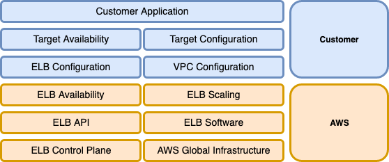

# Home

This section provides best practices related to security and covers both [Application Load Balancer (ALB)](https://docs.aws.amazon.com/elasticloadbalancing/latest/application/introduction.html){:target="_blank"} and [Network Load Balancer (NLB)](https://docs.aws.amazon.com/elasticloadbalancing/latest/network/introduction.html){:target="_blank"}.

--8<-- "howtouse.md"

## Security Overview

Elastic Load Balancing (ELB) is built and managed with security as a top priority.

Security is a shared responsibility between AWS and the customer. Generally speaking, AWS is responsible for the “Security of the Cloud” while the customer is responsible for the “Security in the Cloud”. To understand what this means in the context of ELB, refer to the image below:

A few examples can help clarify these responsibility boundaries:

* AWS is responsible for patching the load balancer software in case it becomes affected by a new [Common Vulnerabilities and Exploits (CVE)](https://en.wikipedia.org/wiki/Common_Vulnerabilities_and_Exposures){:target="_blank"}, while the customer is responsible for doing the same for the software running on the targets.
* The customer is responsible for configuring a TLS listener, while ELB is responsible for the TLS implementation running in the load balancer nodes.

!!! abstract "References and Further Reading"

    [Security in Elastic Load Balancing](https://docs.aws.amazon.com/elasticloadbalancing/latest/userguide/security.html){:target="_blank"}

    [Shared Responsibility Model](https://aws.amazon.com/compliance/shared-responsibility-model/){:target="_blank"}

--8<-- "feedback.md"